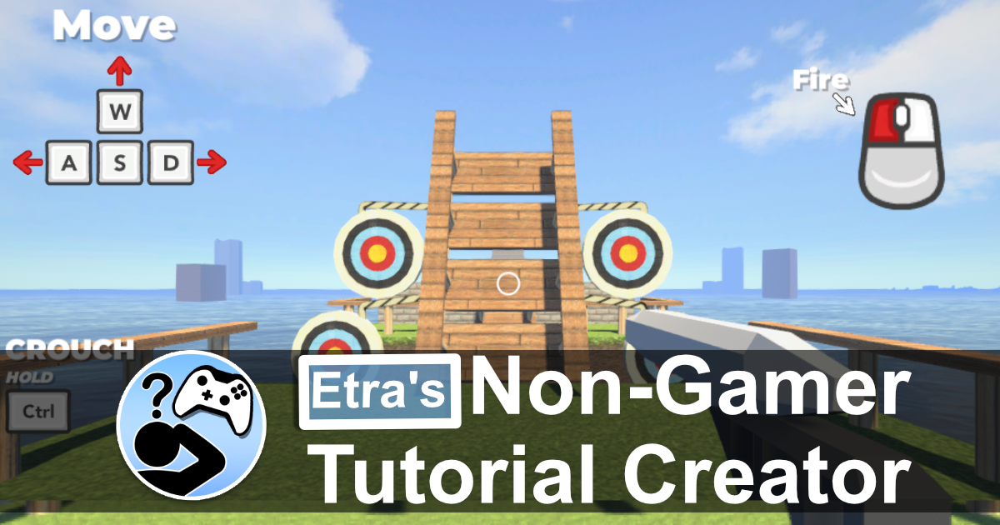

# Etra's Starter Assets

[Games For Non-Gamers Patreon](patreon.com/Games4Nongamers)

Add a Non-Gamer Tutorial to your 3D Unity game to make your project more accessible to Non-Gaming loved ones!

Unity Version for this Github Root:
2020.3.44f1

## Tutorial Videos

* [Overview Trailer](https://youtu.be/5Yb4oaFpZ04)
* [Adding a Non-Gamer Tutorial:](https://youtu.be/yNWQsQpC4vI)
* [Adding Level Chunks and Custom UI:](https://youtu.be/HvJzkzIIy_Q)

## Links

* [Unity Asset Store Page PENDING]()

* [Etra's Lab Discord](https://discord.gg/zZdGJQvNvq)

* [Games For Non-Gamers Patreon](patreon.com/Games4Nongamers)